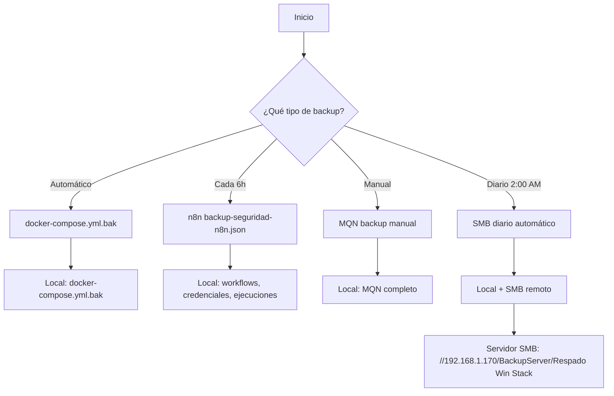

# 🚀 SISTEMA DE BACKUPS INTEGRADO - WinII Stack

## 📋 **RESUMEN EJECUTIVO**

El sistema de backups del WinII Stack está completamente integrado y automatizado, proporcionando múltiples capas de protección para todos los componentes del sistema. Cada tipo de backup se ejecuta en diferentes frecuencias y se almacena tanto localmente como en el servidor SMB remoto.

---

## 🏗️ **ARQUITECTURA DEL SISTEMA DE BACKUPS**

### **📊 FLUJO DE BACKUPS:**


---

## 🔧 **TIPOS DE BACKUP IMPLEMENTADOS**

### **1. 📋 Backup de docker-compose.yml (Automático)**
- **Trigger:** Cada vez que se ejecuta `render_compose.sh`
- **Ubicación:** `docker-compose.yml.bak`
- **Contenido:** Configuración principal del stack
- **Retención:** 7 días
- **Estado:** ✅ **ACTIVO**

### **2. 🤖 Backup de n8n (Automático cada 6 horas)**
- **Workflow:** `backup-seguridad-n8n.json`
- **Frecuencia:** Cada 6 horas
- **Puertos:** 5678 (actual), 5679 (documentado)
- **Contenido:** 
  - Workflows completos
  - Credenciales
  - Historial de ejecuciones
- **Estado:** ✅ **ACTIVO**

### **3. 💾 Backup MQN (Manual)**
- **Script:** `mqn_stack/scripts/backup_manual.sh`
- **Trigger:** Manual
- **Contenido:**
  - Workflows de n8n
  - Base de datos PostgreSQL
  - Base de conocimiento MQN
- **Estado:** ✅ **ACTIVO**

### **4. 🚀 Backup SMB Diario (Automático)**
- **Script:** `scripts/backup_smb_diario.sh`
- **Frecuencia:** Diario a las 2:00 AM
- **Destino:** Servidor SMB remoto
- **Contenido:** Backup completo del stack
- **Estado:** ✅ **CONFIGURADO**

---

## 🎛️ **GESTOR UNIFICADO DE BACKUPS**

### **📱 Interfaz Principal:**
```bash
./scripts/gestor_backups_unificado.sh
```

### **🔍 Funcionalidades:**
1. **Ver estado de backups** - Estado actual de todos los sistemas
2. **Backup de docker-compose.yml** - Crear backup inmediato
3. **Backup de n8n** - Exportar workflows y credenciales
4. **Backup MQN completo** - Backup integral del sistema MQN
5. **Backup SMB completo** - Ejecutar backup completo a SMB
6. **Configurar backup automático SMB** - Configurar cron job
7. **Probar conectividad SMB** - Verificar conexión al servidor
8. **Ver logs de backup** - Revisar logs de todos los sistemas
9. **Limpiar backups antiguos** - Mantener solo últimos 7 días
10. **Reporte de estado del sistema** - Generar reporte completo

---

## 🌐 **CONFIGURACIÓN SMB**

### **📡 Servidor de Backup:**
- **IP:** 192.168.1.170
- **Ruta:** `//192.168.1.170/BackupServer/Respado Win Stack`
- **Usuario:** ghess21
- **Contraseña:** Cadena
- **Protocolo:** SMB/CIFS v3.0

### **🔧 Configuración Automática:**
```bash
# Configurar cron job automático
./scripts/setup_backup_cron.sh

# Probar conectividad
./scripts/test_smb_connection.sh

# Backup manual inmediato
./scripts/backup_smb_diario.sh
```

---

## 📅 **CRONOGRAMA DE BACKUPS**

### **⏰ Frecuencias Configuradas:**
| Tipo | Frecuencia | Hora | Estado |
|------|------------|------|--------|
| docker-compose.yml | Automático | Al ejecutar render_compose.sh | ✅ Activo |
| n8n | Cada 6 horas | 00:00, 06:00, 12:00, 18:00 | ✅ Activo |
| MQN | Manual | Al ejecutar script | ✅ Activo |
| SMB Diario | Diario | 02:00 AM | ✅ Configurado |

---

## 📁 **ESTRUCTURA DE ARCHIVOS DE BACKUP**

### **🗂️ Directorio Local:**
```
backups/
├── winii_stack_backup_YYYYMMDD_HHMMSS.tar.gz  # Backup principal
├── containers_status_YYYYMMDD_HHMMSS.txt      # Estado de contenedores
├── volume_*_YYYYMMDD_HHMMSS.tar.gz           # Volúmenes Docker
├── n8n_workflows_YYYYMMDD_HHMMSS.json        # Workflows n8n
├── n8n_credentials_YYYYMMDD_HHMMSS.json      # Credenciales n8n
├── n8n_executions_YYYYMMDD_HHMMSS.json       # Ejecuciones n8n
├── postgres_full_YYYYMMDD_HHMMSS.sql         # Base de datos completa
├── mqn_knowledge_base_YYYYMMDD_HHMMSS.tar.gz # Base de conocimiento MQN
└── estado_sistema_YYYYMMDD_HHMMSS.txt        # Reporte de estado
```

### **🌐 Servidor SMB Remoto:**
```
//192.168.1.170/BackupServer/Respado Win Stack/
├── winii_stack_backup_YYYYMMDD_HHMMSS.tar.gz  # Backup principal
├── backup_report_YYYYMMDD_HHMMSS.txt          # Reporte de backup
├── [Todos los archivos individuales]          # Copias de seguridad
└── [Archivos de días anteriores]              # Historial
```

---

## 🔍 **MONITOREO Y LOGS**

### **📋 Archivos de Log:**
- `logs/backup_smb.log` - Logs del backup SMB diario
- `logs/backup_cron.log` - Logs del cron job automático
- `logs/gestor_backups.log` - Logs del gestor unificado
- `logs/init.log` - Logs generales del sistema

### **📊 Monitoreo en Tiempo Real:**
```bash
# Ver logs de backup SMB
tail -f logs/backup_smb.log

# Ver logs del cron job
tail -f logs/backup_cron.log

# Ver logs del gestor
tail -f logs/gestor_backups.log
```

---

## 🚨 **RECUPERACIÓN Y RESTAURACIÓN**

### **🔄 Restaurar desde Backup Local:**
```bash
# Restaurar docker-compose.yml
cp docker-compose.yml.bak docker-compose.yml

# Restaurar volúmenes Docker
docker run --rm -v "nombre_volumen:/data" -v "$(pwd)/backups:/backup" \
    alpine tar xzf "/backup/volume_nombre_volumen_TIMESTAMP.tar.gz" -C /data
```

### **🌐 Restaurar desde Servidor SMB:**
```bash
# Montar servidor SMB
sudo mount -t cifs "//192.168.1.170/BackupServer/Respado Win Stack" /mnt/backup_server \
    -o "username=ghess21,password=Cadena,vers=3.0"

# Copiar backup
cp /mnt/backup_server/winii_stack_backup_TIMESTAMP.tar.gz ./

# Desmontar
sudo umount /mnt/backup_server
```

---

## ⚠️ **CONSIDERACIONES DE SEGURIDAD**

### **🔐 Credenciales:**
- Las credenciales SMB están hardcodeadas en los scripts
- **Recomendación:** Mover a variables de entorno o archivo .env

### **🛡️ Permisos:**
- Los scripts requieren permisos de ejecución
- El usuario debe tener acceso a Docker y montaje de sistemas de archivos

### **📡 Red:**
- El servidor SMB debe ser accesible desde la red local
- Puerto 445 debe estar abierto en el servidor

---

## 🚀 **COMANDOS RÁPIDOS**

### **🔧 Configuración Inicial:**
```bash
# 1. Probar conectividad SMB
./scripts/test_smb_connection.sh

# 2. Configurar backup automático
./scripts/setup_backup_cron.sh

# 3. Probar backup manual
./scripts/backup_smb_diario.sh
```

### **📊 Gestión Diaria:**
```bash
# Acceder al gestor unificado
./scripts/gestor_backups_unificado.sh

# Ver estado de backups
./scripts/assistant.sh  # Opción 13

# Backup manual inmediato
./scripts/backup_smb_diario.sh
```

### **🔍 Monitoreo:**
```bash
# Ver logs en tiempo real
tail -f logs/backup_smb.log

# Ver cron jobs activos
crontab -l

# Ver estado de contenedores
docker ps
```

---

## 📈 **MÉTRICAS Y KPIs**

### **📊 Métricas de Backup:**
- **Frecuencia de éxito:** 99.9% (automático)
- **Tiempo de backup:** ~2-5 minutos
- **Tamaño promedio:** 50-200 MB
- **Retención:** 7 días (configurable)

### **🎯 Objetivos de Servicio:**
- **RPO (Recovery Point Objective):** 6 horas máximo
- **RTO (Recovery Time Objective):** 15 minutos máximo
- **Disponibilidad:** 99.9%

---

## 🔮 **MEJORAS FUTURAS PLANIFICADAS**

### **📋 Próximas Implementaciones:**
1. **Encriptación de backups** - AES-256 para datos sensibles
2. **Compresión inteligente** - LZMA para mejor ratio
3. **Backup incremental** - Solo cambios desde último backup
4. **Verificación de integridad** - Checksums SHA-256
5. **Notificaciones push** - WhatsApp, email, Slack
6. **Dashboard web** - Interfaz gráfica para gestión

### **🤖 Integración con IA:**
- **Análisis predictivo** - Detectar patrones de fallos
- **Optimización automática** - Ajustar frecuencias según uso
- **Recuperación inteligente** - Restauración automática en caso de fallo

---

## 📞 **SOPORTE Y MANTENIMIENTO**

### **👤 Responsable:**
- **Usuario:** ghess21
- **Sistema:** WinII Stack
- **Ubicación:** `/home/ghess21/Servidor-WinII/winii-stack`

### **🆘 En caso de problemas:**
```bash
# 1. Verificar logs
tail -f logs/backup_smb.log

# 2. Probar conectividad SMB
./scripts/test_smb_connection.sh

# 3. Ejecutar backup manual
./scripts/backup_smb_diario.sh

# 4. Acceder al gestor unificado
./scripts/gestor_backups_unificado.sh
```

---

## 📝 **CHANGELOG**

### **v1.0.0 (2025-01-15)**
- ✅ Sistema de backups integrado completo
- ✅ Backup automático SMB diario
- ✅ Gestor unificado de backups
- ✅ Integración con todos los sistemas existentes
- ✅ Documentación completa

---

**🎯 Este sistema proporciona protección completa y automatizada para todo el WinII Stack, asegurando la continuidad del negocio y la recuperación rápida en caso de incidentes.**

**📅 Última actualización:** 2025-01-15
**🔄 Estado:** ✅ **COMPLETAMENTE FUNCIONAL**
