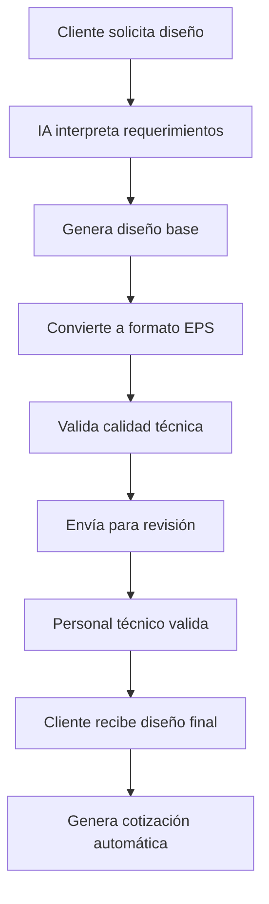

# 🎨 ASISTENTE GRÁFICO DE IA - Media Quality Net

## 📋 **DESCRIPCIÓN GENERAL**

El Asistente Gráfico de IA es un sistema inteligente que ayuda a los clientes a crear gráficos de impresión en formato EPS (Encapsulated PostScript) para serigrafía, impresión digital y sublimación. El sistema utiliza IA para generar diseños profesionales que luego son validados por el personal técnico de MQN.

---

## 🎯 **OBJETIVOS DEL SISTEMA**

### **🎨 Para Clientes:**
- Crear diseños profesionales sin conocimientos técnicos
- Visualizar resultados antes de la impresión
- Obtener cotizaciones automáticas basadas en el diseño
- Comunicarse directamente con el equipo de MQN

### **🏢 Para MQN:**
- Reducir tiempo de diseño y cotización
- Estandarizar procesos de creación de gráficos
- Mejorar la experiencia del cliente
- Aumentar la eficiencia operativa

---

## 🏗️ **ARQUITECTURA DEL SISTEMA**

### **🔧 Componentes Principales:**
```
asistente_grafico_ia/
├── frontend/                 # Interfaz web del cliente
├── backend/                  # API y lógica de negocio
├── ai_engine/               # Motor de IA para generación
├── eps_generator/           # Generador de archivos EPS
├── validation_system/       # Sistema de validación técnica
├── client_interface/        # Interfaz de comunicación cliente
├── design_templates/        # Plantillas de diseño
├── quality_checker/         # Verificador de calidad EPS
└── integration/             # Integración con sistemas MQN
```

---

## 🤖 **FUNCIONALIDADES DE IA**

### **🎨 Generación de Diseños:**
- **Diseño por descripción:** "Quiero una playera con un dragón azul"
- **Diseño por referencia:** Subir imagen y convertir a EPS
- **Diseño por plantilla:** Seleccionar y personalizar plantillas
- **Diseño por estilo:** Elegir estilos artísticos (vintage, moderno, etc.)

### **🔍 Análisis Inteligente:**
- **Detección de elementos:** Identificar texto, imágenes, formas
- **Optimización automática:** Ajustar para técnicas de impresión
- **Validación técnica:** Verificar compatibilidad con procesos
- **Sugerencias de mejora:** Recomendaciones para mejor resultado

---

## 📱 **INTERFACES DE USUARIO**

### **💻 Frontend Web:**
- **Diseño responsivo** para móviles y computadoras
- **Editor visual** con herramientas intuitivas
- **Galería de plantillas** organizadas por categorías
- **Chat en vivo** con asistente de IA
- **Sistema de cuentas** para clientes

### **📱 WhatsApp Integration:**
- **Comandos por chat** para crear diseños
- **Envío de imágenes** para procesamiento
- **Notificaciones** de estado del diseño
- **Descarga directa** de archivos EPS

---

## 🎨 **TIPOS DE DISEÑO SOPORTADOS**

### **👕 Playeras y Ropa:**
- **Logotipos corporativos**
- **Diseños artísticos**
- **Texto personalizado**
- **Ilustraciones vectoriales**

### **☕ Tazas y Objetos:**
- **Diseños circulares**
- **Patrones repetitivos**
- **Textos curvos**
- **Ilustraciones adaptativas**

### **📄 Posters y Tarjetas:**
- **Diseños de alta resolución**
- **Composición tipográfica**
- **Elementos gráficos**
- **Layouts profesionales**

---

## 🔧 **TECNOLOGÍAS UTILIZADAS**

### **🤖 IA y Machine Learning:**
- **Stable Diffusion** para generación de imágenes
- **OpenAI GPT** para interpretación de texto
- **Computer Vision** para análisis de imágenes
- **NLP** para comprensión de requerimientos

### **🎨 Generación de Gráficos:**
- **Inkscape** para creación de vectores
- **ImageMagick** para procesamiento de imágenes
- **Pillow (PIL)** para manipulación de imágenes
- **SVG to EPS** para conversión de formatos

### **🌐 Desarrollo Web:**
- **React.js** para frontend
- **FastAPI** para backend
- **PostgreSQL** para base de datos
- **Redis** para caché y sesiones

---

## 📊 **FLUJO DE TRABAJO**

### **🔄 Proceso Completo:**


### **⏱️ Tiempos Estimados:**
- **Diseño simple:** 2-5 minutos
- **Diseño complejo:** 10-15 minutos
- **Validación técnica:** 1-2 horas
- **Entrega final:** 24-48 horas

---

## 🔒 **SISTEMA DE VALIDACIÓN**

### **👨‍💼 Validación Técnica:**
- **Personal calificado** revisa cada diseño
- **Checklist de calidad** estandarizado
- **Comentarios técnicos** para el cliente
- **Aprobación final** antes de la entrega

### **✅ Criterios de Validación:**
- **Calidad del EPS:** Resolución y vectores
- **Compatibilidad:** Con técnicas de impresión
- **Tamaño:** Adecuado para el producto
- **Colores:** Separación correcta para serigrafía

---

## 💰 **MODELO DE NEGOCIO**

### **💵 Estructura de Precios:**
- **Diseño básico:** $50 - $100 MXN
- **Diseño complejo:** $150 - $300 MXN
- **Diseño premium:** $400 - $800 MXN
- **Paquete empresarial:** $1000+ MXN

### **🎁 Servicios Incluidos:**
- **Generación del diseño**
- **Conversión a EPS**
- **Validación técnica**
- **2 revisiones gratuitas**
- **Soporte técnico**

---

## 🚀 **IMPLEMENTACIÓN**

### **📅 Fases del Proyecto:**
1. **Fase 1:** Desarrollo del motor de IA básico
2. **Fase 2:** Interfaz web del cliente
3. **Fase 3:** Sistema de validación técnica
4. **Fase 4:** Integración con WhatsApp
5. **Fase 5:** Pruebas y optimización
6. **Fase 6:** Lanzamiento oficial

### **⏱️ Cronograma:**
- **Desarrollo total:** 8-12 semanas
- **MVP funcional:** 4-6 semanas
- **Pruebas beta:** 2-3 semanas
- **Lanzamiento:** Semana 12

---

## 🔮 **ROADMAP FUTURO**

### **📈 Mejoras Planificadas:**
- **Realidad aumentada** para visualización 3D
- **Generación de videos** promocionales
- **Integración con CRM** empresarial
- **App móvil nativa** para iOS/Android
- **API pública** para desarrolladores

### **🌍 Expansión:**
- **Múltiples idiomas** (inglés, francés)
- **Mercados internacionales**
- **Franquicias y licencias**
- **Plataforma SaaS** para otras empresas

---

## 📞 **CONTACTO Y SOPORTE**

### **👤 Equipo de Desarrollo:**
- **Líder técnico:** ghess21
- **Diseñador UX/UI:** Por asignar
- **Especialista en IA:** Por asignar
- **Validadores técnicos:** Personal MQN

### **🆘 Soporte Técnico:**
- **Email:** soporte@mqn.com
- **WhatsApp:** 9671262441
- **Horarios:** Lunes a Viernes 9:00 - 18:00

---

**🎯 El Asistente Gráfico de IA revolucionará la forma en que MQN crea diseños para sus clientes, proporcionando un servicio de alta calidad, rápido y accesible las 24/7.**

**📅 Fecha de creación:** 2025-01-15
**🔄 Estado:** �� **EN DESARROLLO**
