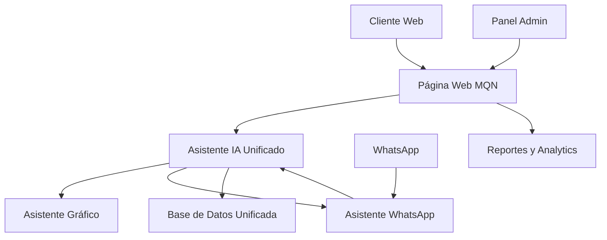

# 🌐 PÁGINA WEB PRINCIPAL - Media Quality Net

## 📋 **DESCRIPCIÓN GENERAL**

La página web principal de Media Quality Net es una plataforma unificada que integra todos los servicios de la empresa, incluyendo los asistentes de IA, en una experiencia web profesional y moderna. Esta plataforma servirá como punto central para clientes, proveedores y personal de MQN.

---

## 🎯 **OBJETIVOS DE LA PLATAFORMA**

### **🏢 Para Media Quality Net:**
- **Presencia digital profesional** y moderna
- **Generación de leads** cualificados
- **Automatización** de procesos de venta
- **Integración completa** con sistemas existentes
- **Escalabilidad** para crecimiento futuro

### **👥 Para Clientes:**
- **Experiencia de usuario** excepcional
- **Acceso 24/7** a servicios y productos
- **Cotizaciones automáticas** y transparentes
- **Seguimiento en tiempo real** de proyectos
- **Comunicación directa** con el equipo

### **🤖 Para Asistentes IA:**
- **Plataforma unificada** de operación
- **Integración seamless** con servicios web
- **Aprendizaje continuo** basado en uso
- **Optimización automática** de procesos

---

## 🏗️ **ARQUITECTURA DE LA PLATAFORMA**

### **📊 COMPONENTES PRINCIPALES:**
```
mqn_web/
├── frontend/                 # React.js - Interfaz principal
│   ├── public/              # Assets estáticos
│   └── src/
│       ├── components/      # Componentes reutilizables
│       ├── pages/           # Páginas principales
│       ├── services/        # Servicios de API
│       ├── hooks/           # Hooks personalizados
│       ├── context/         # Contexto de la aplicación
│       ├── styles/          # Estilos y CSS
│       └── utils/           # Utilidades y helpers
├── backend/                  # Node.js/Express - API principal
│   ├── routes/              # Rutas de la API
│   ├── controllers/         # Controladores de lógica
│   ├── models/              # Modelos de datos
│   ├── middleware/          # Middleware personalizado
│   ├── services/            # Servicios de negocio
│   ├── utils/               # Utilidades
│   └── config/              # Configuraciones
├── ai_integration/           # Integración de asistentes IA
│   ├── graphic_assistant/   # Asistente gráfico
│   ├── whatsapp_assistant/  # Asistente WhatsApp
│   ├── unified_ai/          # IA unificada
│   └── ai_orchestrator/     # Orquestador de IA
├── database/                 # Base de datos unificada
│   ├── migrations/          # Migraciones de BD
│   ├── seeds/               # Datos iniciales
│   └── schemas/             # Esquemas de BD
└── docker/                   # Configuración Docker
    ├── docker-compose.yml   # Servicios principales
    ├── nginx/               # Proxy reverso
    └── ssl/                 # Certificados SSL
```

### **🔗 FLUJO DE INTEGRACIÓN:**


---

## 🎨 **DISEÑO Y UX/UI**

### **🎯 PRINCIPIOS DE DISEÑO:**
- **Minimalismo moderno** con enfoque en funcionalidad
- **Responsive design** para todos los dispositivos
- **Accesibilidad universal** (WCAG 2.1 AA)
- **Velocidad de carga** optimizada
- **SEO friendly** para mejor posicionamiento

### **🎨 PALETA DE COLORES:**
- **Primario:** Azul corporativo (#2563EB)
- **Secundario:** Verde éxito (#10B981)
- **Acento:** Naranja energía (#F59E0B)
- **Neutro:** Gris profesional (#6B7280)
- **Fondo:** Blanco limpio (#FFFFFF)

### **📱 DISEÑO RESPONSIVE:**
- **Mobile First** - Optimizado para móviles
- **Tablet** - Adaptado para tablets
- **Desktop** - Experiencia completa
- **Progressive Web App** - Funcionalidad offline

---

## 📄 **PÁGINAS PRINCIPALES**

### **🏠 PÁGINA DE INICIO:**
- **Hero Section** con mensaje principal
- **Servicios destacados** con iconos
- **Catálogo de productos** destacados
- **Testimonios** de clientes satisfechos
- **Estadísticas** de la empresa
- **Formulario de contacto** rápido

### **🛍️ CATÁLOGO DE PRODUCTOS:**
- **Categorías organizadas** por tipo
- **Filtros avanzados** (precio, técnica, material)
- **Vista de cuadrícula** y lista
- **Búsqueda inteligente** con autocompletado
- **Comparación** de productos
- **Favoritos** y lista de deseos

### **💰 SISTEMA DE COTIZACIONES:**
- **Calculadora de precios** interactiva
- **Formulario de solicitud** paso a paso
- **Seguimiento** de cotizaciones
- **Historial** de pedidos
- **Notificaciones** por email/SMS
- **Descarga** de cotizaciones en PDF

### **👤 PORTAL DE CLIENTES:**
- **Registro y login** seguro
- **Perfil de cliente** personalizable
- **Dashboard** con resumen de actividad
- **Historial de pedidos** detallado
- **Estado de proyectos** en tiempo real
- **Chat en vivo** con soporte

### **⚙️ PANEL ADMINISTRATIVO:**
- **Dashboard** con métricas clave
- **Gestión de productos** completa
- **Gestión de clientes** y leads
- **Gestión de pedidos** y proyectos
- **Reportes** y analytics
- **Configuración** del sistema

---

## 🤖 **INTEGRACIÓN DE ASISTENTES IA**

### **🎨 ASISTENTE GRÁFICO:**
- **Widget integrado** en la página web
- **Generación de diseños** por descripción
- **Vista previa** en tiempo real
- **Descarga** de archivos EPS
- **Historial** de diseños generados
- **Integración** con sistema de cotizaciones

### **📱 ASISTENTE WHATSAPP:**
- **Chat widget** flotante en la web
- **Respuestas automáticas** inteligentes
- **Generación de cotizaciones** por chat
- **Integración** con asistente gráfico
- **Notificaciones** push
- **Historial** de conversaciones

### **🧠 IA UNIFICADA:**
- **Coordinación** entre todos los asistentes
- **Aprendizaje continuo** basado en interacciones
- **Análisis de patrones** de uso
- **Optimización automática** de respuestas
- **Personalización** para cada cliente
- **Reportes** de inteligencia de negocio

---

## 🔧 **TECNOLOGÍAS IMPLEMENTADAS**

### **🌐 FRONTEND:**
- **React.js 18** - Biblioteca principal
- **TypeScript** - Tipado estático
- **Tailwind CSS** - Framework de estilos
- **Framer Motion** - Animaciones fluidas
- **React Query** - Gestión de estado
- **React Router** - Enrutamiento
- **React Hook Form** - Formularios
- **React Dropzone** - Subida de archivos

### **⚙️ BACKEND:**
- **Node.js** - Runtime de JavaScript
- **Express.js** - Framework web
- **TypeScript** - Tipado estático
- **JWT** - Autenticación segura
- **Bcrypt** - Encriptación de contraseñas
- **Multer** - Manejo de archivos
- **Nodemailer** - Envío de emails
- **Socket.io** - Comunicación en tiempo real

### **🗄️ BASE DE DATOS:**
- **PostgreSQL** - Base de datos principal
- **Redis** - Caché y sesiones
- **Prisma** - ORM moderno
- **Migrations** - Control de versiones
- **Seeds** - Datos iniciales
- **Backups** - Automáticos y seguros

### **🐳 DEVOPS:**
- **Docker** - Contenedores
- **Docker Compose** - Orquestación
- **Nginx** - Proxy reverso
- **SSL/TLS** - Certificados de seguridad
- **GitHub Actions** - CI/CD
- **Monitoring** - Logs y métricas

---

## 🚀 **FUNCIONALIDADES AVANZADAS**

### **🔍 BÚSQUEDA INTELIGENTE:**
- **Autocompletado** en tiempo real
- **Búsqueda semántica** por descripción
- **Filtros inteligentes** adaptativos
- **Historial** de búsquedas
- **Sugerencias** personalizadas

### **📊 ANALYTICS Y REPORTES:**
- **Dashboard** en tiempo real
- **Métricas de conversión** detalladas
- **Análisis de comportamiento** del usuario
- **Reportes automáticos** por email
- **Exportación** a Excel/PDF

### **🔔 NOTIFICACIONES:**
- **Push notifications** en navegador
- **Email automático** para eventos importantes
- **SMS** para notificaciones críticas
- **WhatsApp** para seguimiento
- **Personalización** por usuario

### **🌍 INTERNACIONALIZACIÓN:**
- **Múltiples idiomas** (Español, Inglés)
- **Monedas locales** (MXN, USD)
- **Formatos de fecha** regionales
- **Contenido localizado** por región
- **SEO multiidioma**

---

## 💰 **MODELO DE NEGOCIO**

### **💵 SERVICIOS GRATUITOS:**
- **Navegación** por el catálogo
- **Información** de productos
- **Calculadora** de precios básica
- **Contacto** con el equipo
- **Blog** y recursos

### **💵 SERVICIOS PREMIUM:**
- **Cotizaciones detalladas** personalizadas
- **Acceso prioritario** a nuevos productos
- **Soporte técnico** dedicado
- **Descuentos** especiales
- **Acceso anticipado** a ofertas

### **💵 SERVICIOS CORPORATIVOS:**
- **Portal personalizado** para empresas
- **API de integración** con sistemas internos
- **Reportes personalizados** y detallados
- **Gestor de cuenta** dedicado
- **Capacitación** del equipo

---

## 📅 **CRONOGRAMA DE IMPLEMENTACIÓN**

### **🏗️ FASE 1: Página Web Principal (2-3 semanas)**
- [ ] Diseño de la interfaz y wireframes
- [ ] Desarrollo del frontend React.js
- [ ] Desarrollo del backend Node.js
- [ ] Base de datos unificada
- [ ] Sistema de autenticación
- [ ] Panel administrativo básico

### **🤖 FASE 2: Integración de Asistentes IA (2-3 semanas)**
- [ ] Integrar asistente gráfico existente
- [ ] Crear asistente WhatsApp integrado
- [ ] Desarrollar asistente IA unificado
- [ ] Orquestador de servicios IA
- [ ] Sistema de aprendizaje continuo

### **🔗 FASE 3: Integración WhatsApp (1-2 semanas)**
- [ ] API de WhatsApp Business
- [ ] Chat automático inteligente
- [ ] Integración con asistente gráfico
- [ ] Sistema de notificaciones
- [ ] Respuestas automáticas

### **🧪 FASE 4: Pruebas y Optimización (1-2 semanas)**
- [ ] Pruebas de integración
- [ ] Optimización de rendimiento
- [ ] Pruebas de usuario
- [ ] Ajustes de UX/UI
- [ ] Documentación final

---

## 🔮 **ROADMAP FUTURO**

### **📈 MEJORAS PLANIFICADAS:**
- **Realidad aumentada** para visualización 3D
- **Generación de videos** promocionales
- **Integración con CRM** empresarial
- **App móvil nativa** para iOS/Android
- **API pública** para desarrolladores
- **Marketplace** de productos de terceros

### **🌍 EXPANSIÓN:**
- **Múltiples idiomas** (inglés, francés, portugués)
- **Mercados internacionales** (Estados Unidos, Canadá)
- **Franquicias y licencias** del sistema
- **Plataforma SaaS** para otras empresas
- **Integración** con redes sociales
- **E-commerce** completo

---

## 📞 **CONTACTO Y SOPORTE**

### **👤 Equipo de Desarrollo:**
- **Líder técnico:** ghess21
- **Diseñador UX/UI:** Por asignar
- **Desarrollador Frontend:** Por asignar
- **Desarrollador Backend:** Por asignar
- **Especialista en IA:** Por asignar

### **🆘 Soporte Técnico:**
- **Email:** soporte@mqn.com
- **WhatsApp:** 9671262441
- **Horarios:** Lunes a Viernes 9:00 - 18:00
- **Chat en vivo:** Disponible en la web
- **Documentación:** Completa y actualizada

---

**🎯 La página web principal de Media Quality Net será la plataforma unificada que revolucione la presencia digital de la empresa, integrando todos los servicios y asistentes de IA en una experiencia web excepcional.**

**📅 Fecha de creación:** 2025-01-15
**🔄 Estado:** 🚧 **EN DESARROLLO - ESTRUCTURA PLANIFICADA**
